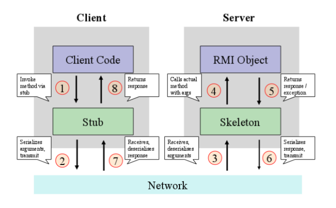

## 📡 RMI - Remote method invocation
O conceito de RMI consiste em invocar remotamente métodos em objetos distribuídos. Em palavras simples, a idéia é possuir objetos espalhados pela rede e conseguir chamar os métodos desses objetos através da rede.

Invocação remota tradicionalmente se divide em duas subáreas:

- RPC (Remote procedure call) amplia o conceito de chamada de procedimentos e funções para sistemas distribuídos, habilitando um processo a chamar uma função em um nó remoto da rede.
- RMI (Remote method invocation) é muito similar ao RPC porém operando em conceitos da orientação a objetos. Neste conceito, podemos passar objetos como parâmetros em invocações remotas.

### 🌍 Objetos distribuídos
O modelo de objetos distribuídos usa princípios de orientação a objetos para programação distribuída.
Em uma aplicação distribuída, cada processo em um nó ou host contém uma coleção de objetos, dos quais alguns podem receber invocações locais e remotas.
As invocações de métodos entre objetos em diferentes processos são conhecidas como invocação de método remoto, independentemente dos processos estarem sendo executados na mesma máquina ou em diferentes máquinas.

Objetos distribuídos podem adotar uma arquitetura client-server, mas outros modelos arquitetônicos também podem ser aplicados. 
Na arquitetura client-server, o server é o nó responsável por disponibilizar os objetos remotos para invocação por parte de outros processos.

### 🪄 Java RMI
O Java Remote Method Invocation (Java RMI) é uma extensão do modelo de objeto Java
para suportar objetos distribuídos, onde métodos de objetos Java remotos podem ser
invocados a partir de outras máquinas virtuais Java, possivelmente em hosts diferentes

O Java RMI utiliza um protocolo de infraestrutura denominado JRMP - Java Remote Method Protocol, o qual suporta apenas a comunicação entre aplicações Java. 
Quando existir a necessidade de comunicação entre Java e aplicações não-Java, pode-se utilizar ainda o protocolo IIOP do CORBA.

O RMI usa serialização deserialização para transmissão e recepção, por este motivo qualquer objeto que possa ser serializado pode ser usado como parâmetro ou retorno de método em RMI.

Arquitetura de uma aplicação RMI

### 🔗 Recursos
- [Docs Java RMI](https://docs.oracle.com/javase/tutorial/rmi/index.html)
- [Difference between RPC and RMI](https://www.geeksforgeeks.org/difference-between-rpc-and-rmi/)